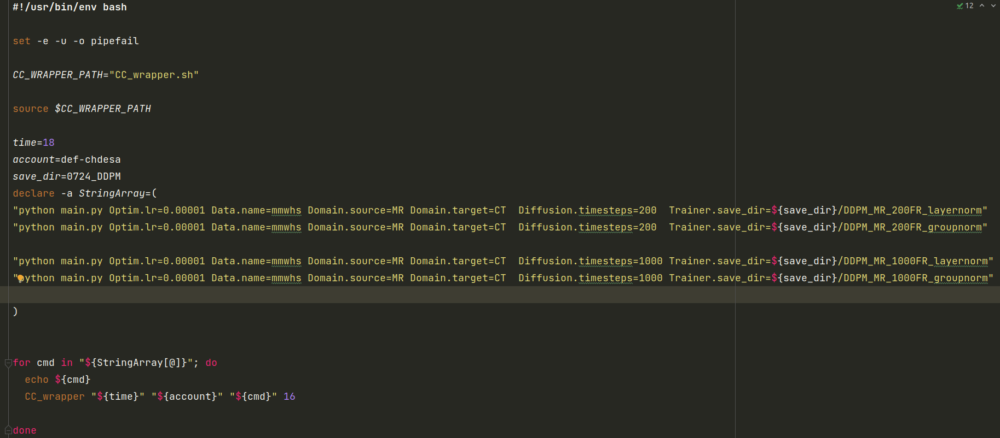

# DPM_code_share

## Introduction to this repo
****************************************************************
**archs:** network architectures

**configs:** hyperparameter settings

**datasets:** dataset files that used for training, you can add your own data files

**DPM:** Diffusion model classes

**general_utils:** toolbox that contains functions that are used in this repo

**trainers:** training box, including training and validation module

## The main file, entry of the code
**main.py** is for original DPM

**main_ControlNetDPM.py** is for contronet (DPM with canny edge as condition)

## Run a batch of cases
create a run.sh file, as follows:

Similarly for main_ControlNetDPM.py

## Notes: above is just the brief instruction for the code using. The configuration is not the optimal.

